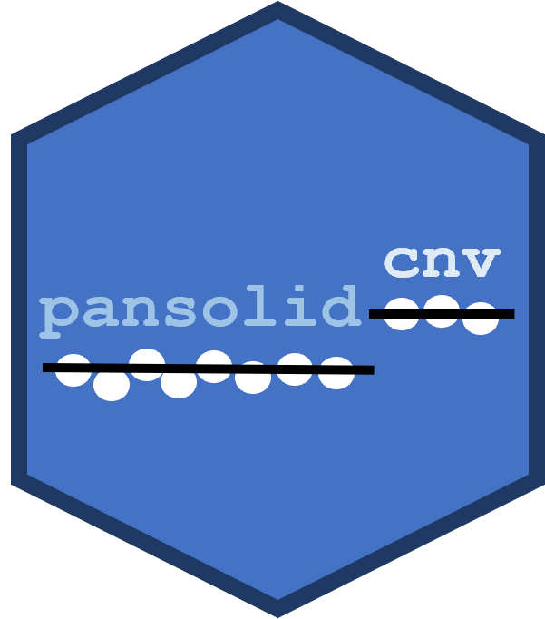

# Solid Cancer Copy Number Variants 

This repository contains R scripts used in the validation and monitoring of copy number variant (CNV) detection on the "Pan Solid" Qiaseq primer panel at the North West Genomic Laboratory Hub (GLH) in Manchester.

## Project Overview

This project was split into multiple sub-projects focussed on validating different CNV types.

| Variant category                     | Validation document | Date of live service | First worksheet |
|:-------------------------------------|:--------------------|:---------------------|:----------------|
| Amplifications of *ERBB2*            | DOC6260             | 2024-04-02           | WS140721        |
| Amplifications for 8 more oncogenes  | DOC6283             | 2024-11-18           | WS147437        |
| Deletions and ploidy states          | DOC6567             | 2025-04-28           | WS152758        |

## Project File Structure

### data

All data is saved internally at the North West GLH, as it contains patient identifiable information. **No data should be available in this Github repository.** The filepath for the data folder is specified in the config.yml file.

### functions

Related functions are grouped together.

### scripts

The scripts folder contains scripts that process, collate and reformat the raw data. Processed data is saved in the relevant folder on the shared drive.

**dev**: the "dev" subfolder stores scripts that are non-essential for performing the final validation analyses. These are scripts that I use for performing one-off tasks or developing new code.

### tests

Automated tests for functions. Where functions are designed to identify patient names within filenames, I have created example files using the names of characters from novels by Leo Tolstoy (Anna Karenina, Pierre Bezukhov etc).

### vignettes

The vignettes folder contains Quarto markdown documents (.qmd) for validation (DOC prefix) and incident investigation (INC prefex) analyses.

## Instructions for Use

To use the scripts in this directory:

1. Download this repo into a local folder on your computer.
2. Check you can access the data folder on the S drive. If the filepath to this folder is slightly different on your computer, update the "data_folderpath" value in the local version of the `config.yml` file.
3. (Optional) Set up an ODBC connection with the version of the DNA Database saved on the SQL server. This is required for analyses that use the `connect_to_dna_db.R` script. Email Joe Shaw for specific instructions on how to do this. This step is not required to rerun the analyses in the validation Quarto files, which have "DOC*.qmd" filenames.

Collated CNV information for samples tested in the live clinical service can be updated by running the `monitor_pansolid_cnv_service.R` script. This script requires an ODBC connection to DNA Database.
